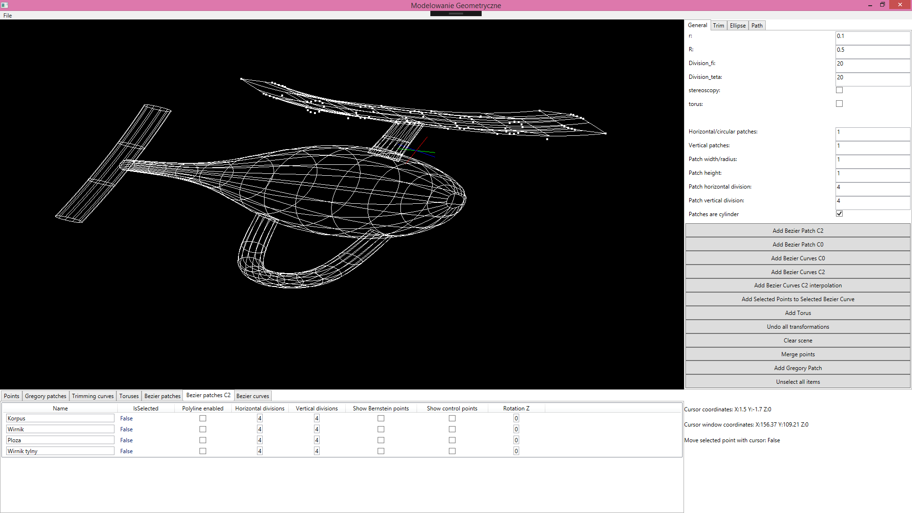
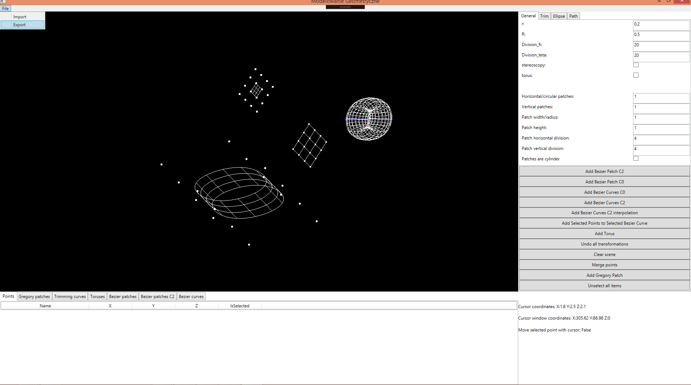
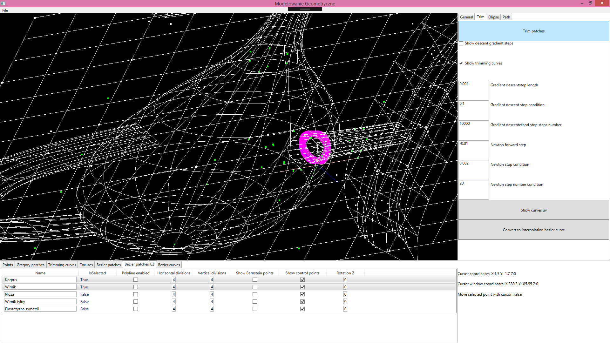
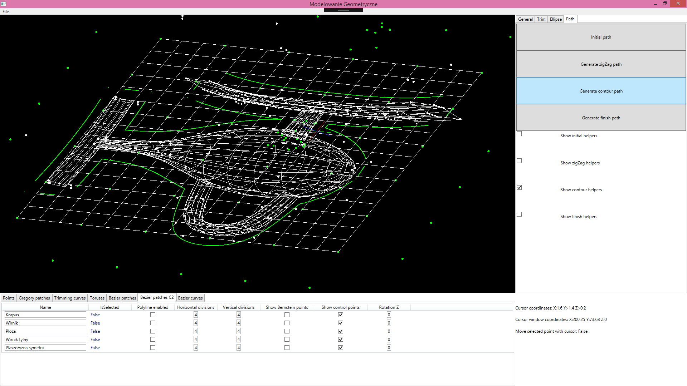

# Modelowanie Geometryczne 
Aplikacja typu CAD/CAM, stworzona została w celu zbudowania modelu geometrycznego śmigłowca oraz wygenerowania pliku GCODE. Otrzymane pliki wsadowe można wykorzystać do wyfrezowania modelu w rzeczywistym materiale za pomocą frezarki CNC.

Używając aplikacji do budowy modelu można wykorzystywać obiekty geometryczne takie jak punkt, sklejane krzywe Béziera o ciągłości C0 oraz C2, interpolacyjne sklejane krzywe Béziera o ciągłości C2, sklejane płatki Béziera o ciągłości C0 i C2, płatki Gregorego, oraz prymitywy w postaci. Dodatkowo udostępniona została użytkownikowi opcja eksportu i importu sceny. 

Użytkownik korzystający z dostarczonego systemu ma możliwość wyznaczania przecięcia powierzchni.

Aplikacja pozwala użytkownikowi wygenerować ścieżki potrzebne do wykorzystania przy produkcji detalu na frezarce CNC. Wygenerowane ścieżki można obejrzeć oraz przetestować w aplikacji Milling Simulator.  

